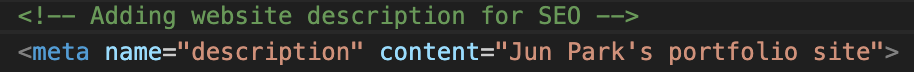

<h1>Portfolio Website</h1>

<h2>DNS setting completed with Google</h2>

In order to make it easier to search the site, the site address(<a href="https://junkyoupark06212025.autos/">https://junkyoupark06212025.autos</a>) was added to <a href="https://search.google.com/search-console/performance/search-analytics?resource_id=https%3A%2F%2Fjunkyoupark06212025.autos%2F">Google search console</a>

<h2>SEO (Search Engine Optimization)</h2>

<a href="https://seositecheckup.com/">https://seositecheckup.com/</a> was used to find out how good my site is optimized 
Initial score of SEO 

Adding the website description in the header 

<h2>Google Analytics</h2>

<a href="https://analytics.google.com/analytics/web/provision/#/provision">https://analytics.google.com/analytics/web/provision/#/provision</a> 
Google tag was added to the index file for google analytics

